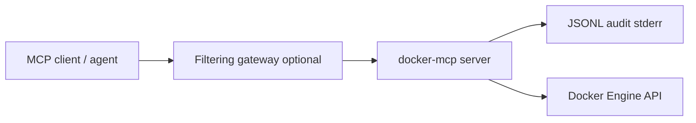

# Architecture

## Overview

docker-mcp is a Rust MCP server built on [rmcp](https://github.com/modelcontextprotocol/rust-sdk) and [bollard](https://github.com/fussybeaver/bollard). Agents connect through an MCP client; the server validates input, checks per-call scopes, calls Docker, sanitizes output, and emits structured audit events.

Production deployments should place a filtering gateway (DLP, rate limits, injection scanning) between agents and this server. The server is designed for gateway inspection: stable tool schemas, bounded responses, and SIEM-ready logs.

## Layers

| Layer | Responsibility |
|-------|----------------|
| `server` | MCP tool definitions (`#[tool_router]`), parameter schemas |
| `service` | Authorization, validation, audit, output sanitization |
| `backend` | Docker API via bollard; compose via controlled subprocess |
| `auth` | Per-call scope checks (`docker:read`, `docker:write`, `docker:compose`) |
| `audit` | Structured `mcp.tool.result` JSONL events |
| `inventory` | Versioned tool registry and fingerprint for drift detection |

## Transport

Stdio only. The process reads MCP messages from stdin and writes responses to stdout. Audit and tracing go to stderr so they do not corrupt the protocol stream.

## Sandboxing

The published container image:

- Runs as non-root user `mcp` (UID 1000)
- Mounts Docker socket read-only
- Disables privileged containers in `docker_run_container`
- Caps log tail and response size

## Tool inventory pinning

Each tool is registered as `name@1` with a stable description and scope. `inventory_fingerprint()` hashes the registry so operators can detect definition drift across releases.

## Related

- [Security](security.md)
- [Tools reference](features/tools.md)
- [Deployment](features/deployment.md)
