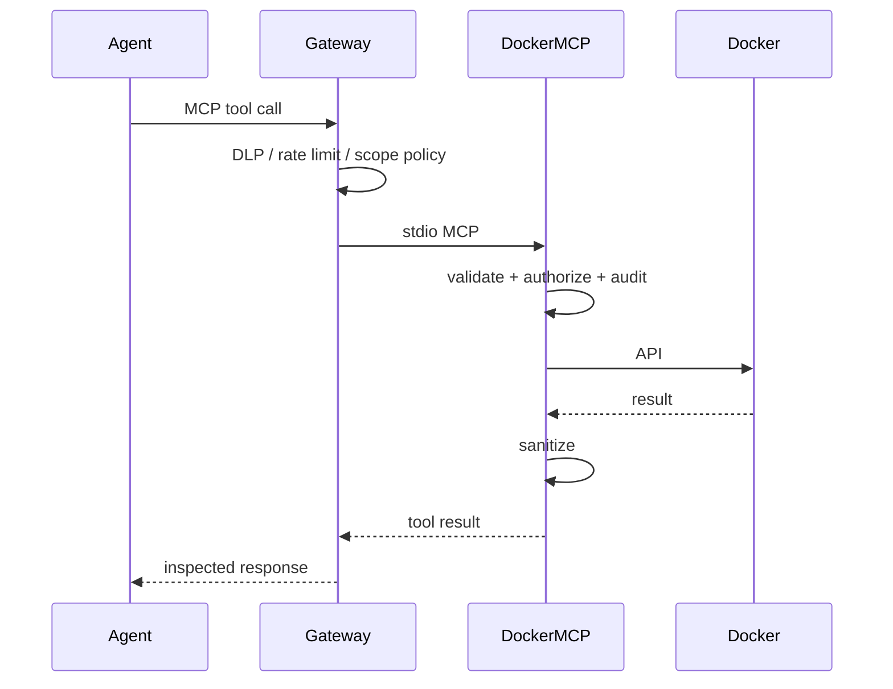

# Deployment

## Container image

Published to GitHub Container Registry on merge to `main`:

```
ghcr.io/<owner>/docker-mcp:latest
```

Pull and run:

```bash
docker run --rm -i \
  -v /var/run/docker.sock:/var/run/docker.sock:ro \
  -e DOCKER_MCP_SCOPES=docker:read \
  -e DOCKER_MCP_CALLER_IDENTITY=production-agent \
  ghcr.io/<owner>/docker-mcp:latest
```

Use `-i` for stdio MCP; do not allocate a TTY.

## Compose service

See root `compose.yaml` for the `docker-mcp` service with recommended environment defaults.

## Gateway placement



Do not expose docker-mcp directly to untrusted networks. Stdio transport expects a parent process (client or gateway).

## Resource limits

Recommended Kubernetes / Docker limits:

| Resource | Suggestion |
|----------|------------|
| CPU | 0.5 core |
| Memory | 256–512 MiB |
| PIDs | 100 |

## Observability

- **Audit:** stderr JSONL (`DOCKER_MCP_AUDIT_JSON=true`)
- **Tracing:** `RUST_LOG=info` (stderr, JSON when audit JSON enabled)
- **Inventory:** log `inventory_fingerprint()` at startup

## Health

There is no HTTP health endpoint. Verify by MCP `list_tools` returning 17 tools.

## Related

- [Getting started](../getting-started.md)
- [Security](../security.md)
